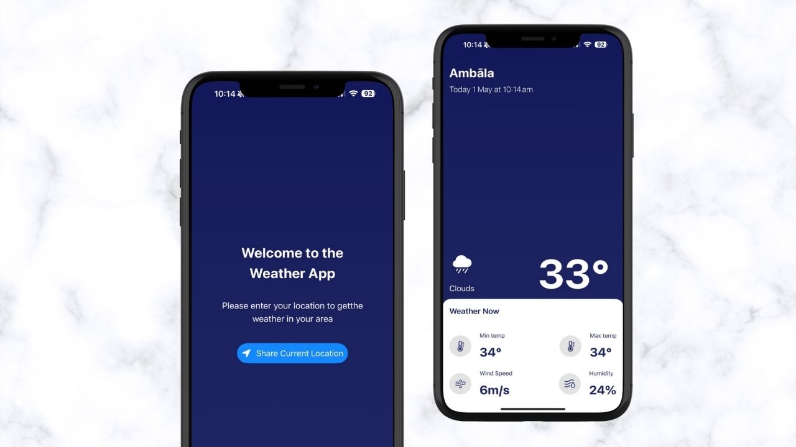

Forecasting – Weather App iOS

🔹 Features:

1. SwiftUI, MVVM architecture
2. Real-time weather data via API
3. Location-based weather forecasts
4. Smooth animations and modern UI
5. Responsive layout for all iPhone sizes

📱 Screenshots:

  

📦 Tools:

1. SwiftUI
2. Core Location
3. REST API
4. Git

🧠 Learnings:

While building this app, I learned how to work with real-time API data, integrate Core Location for accurate user-based forecasts, and structure a SwiftUI app using MVVM to keep the code clean and scalable.

📲 How to Run:

1. Clone the project
2. Open the .xcodeproj or .xcworkspace file in Xcode
3. Make sure location permissions are enabled in your simulator or device
4. Run on a simulator or physical device
5. Replace the API key with your own (if required)
